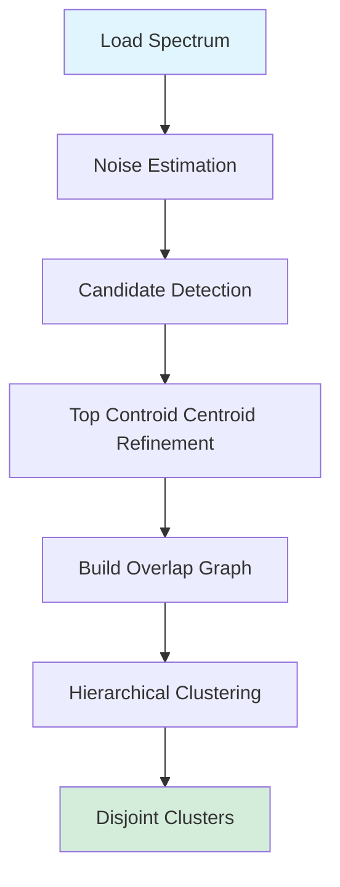
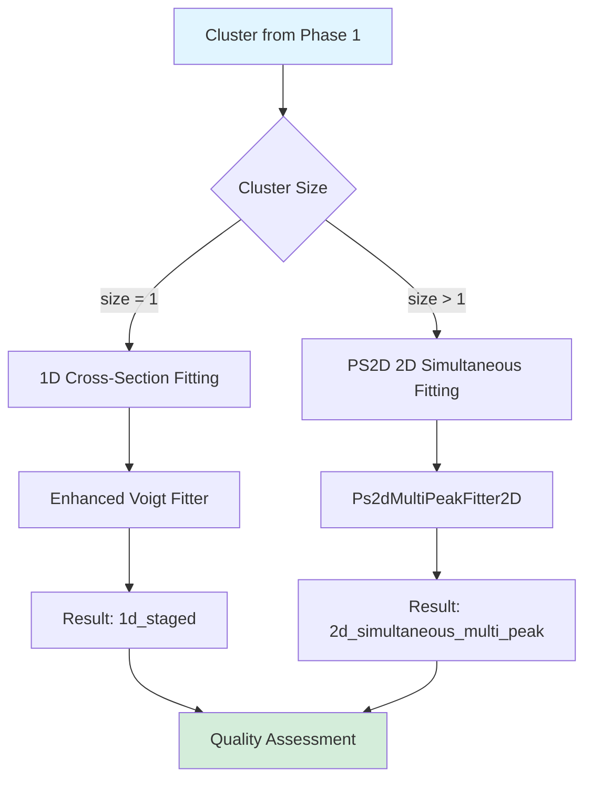
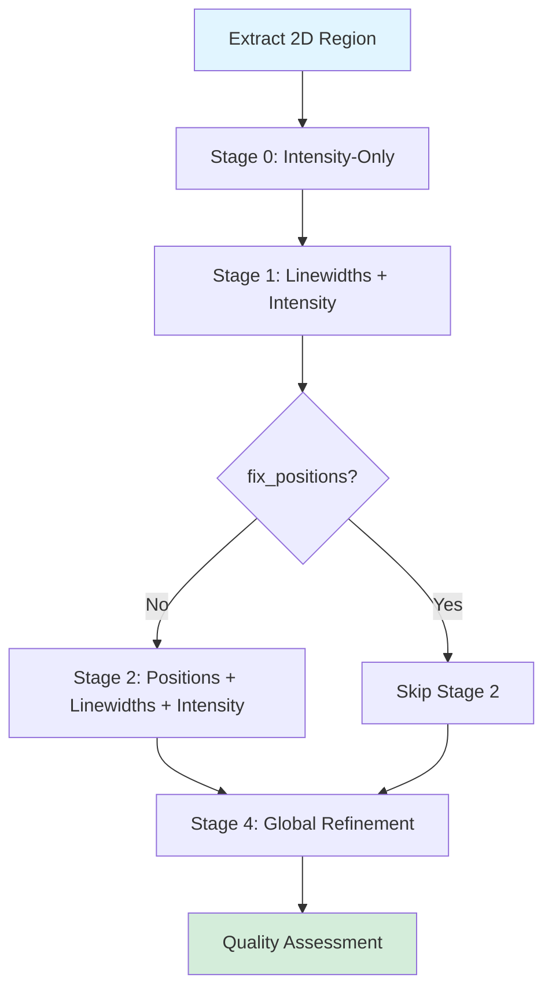
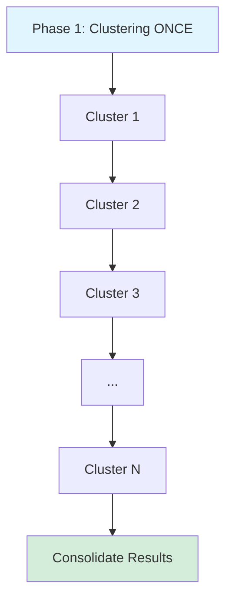
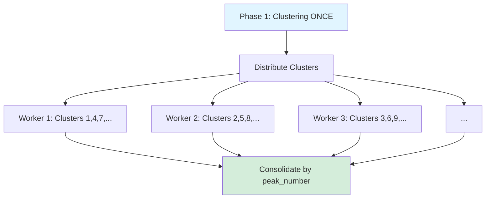
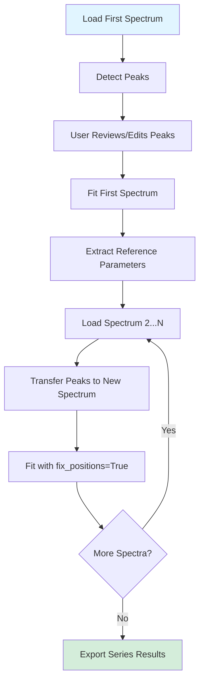
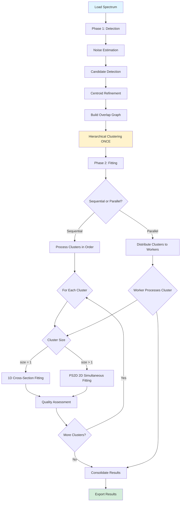

# Peak Fitting Logic - LunaNMR v1.0

**TL;DR**: Two-phase workflow - (1) Detection + Clustering creates disjoint peak groups, (2) Fitting routes single-peak clusters to 1D fallback, multi-peak clusters to PS2D 2D simultaneous fitting. Clustering is deterministic and happens ONCE. Parallel mode distributes entire clusters across workers.

---

## Overview

LunaNMR's fitting logic separates concerns cleanly:

- **Phase 1: Detection & Clustering** - Determines which peaks exist and how they group
- **Phase 2: Fitting Execution** - Applies appropriate algorithm to each cluster

This separation ensures deterministic, reproducible results regardless of sequential vs parallel execution.

---

## Phase 1: Peak Detection and Clustering

### 1.1 Workflow



**Step-by-step:**

1. **Noise Estimation**: Corner sampling or MAD (Median Absolute Deviation)
2. **Candidate Detection**: `scipy.ndimage.maximum_filter` + prominence thresholding
3. **Centroid Refinement**: Intensity-weighted center within ±5% intensity band
4. **Overlap Graph**: Build graph where peaks = nodes, overlaps = edges
5. **Clustering**: Find connected components using `networkx`
6. **Output**: Disjoint clusters - each peak in exactly ONE cluster

### 1.2 Overlap Detection (Two-Circle Touching Test)

```python
# Two peaks overlap if BOTH conditions true:
(|ΔF1| ≤ 2 × threshold_f1) AND (|ΔF2| ≤ 2 × threshold_f2)
```

**Default thresholds:**
- **15N-HSQC**: ±0.04 ppm (F2/1H), ±0.4 ppm (F1/15N)
- **13C-HSQC**: ±0.04 ppm (F2/1H), ±0.1 ppm (F1/13C)

**Key Properties:**
- Transitive: If A overlaps B and B overlaps C, then {A,B,C} form one cluster
- Deterministic: Same peaks always produce same clusters
- Disjoint: Each peak belongs to exactly ONE cluster

**Code Reference:**
- `lunaNMR/core/ps2d_exact_overlap_detector.py:identify_overlap_clusters()`
- `lunaNMR/core/core_integrator.py:~line 2100` (clustering invocation)

### 1.3 Centroid Refinement

**Purpose**: Sub-pixel positioning for flat-top peaks.

**Algorithm** (`enhanced_peak_picker.py:_calculate_top_contour_center`):

```python
# 1. Find peak maximum intensity I_max
# 2. Select pixels with I ∈ [0.95×I_max, 1.05×I_max]
# 3. Calculate intensity-weighted center:
x_c = Σ(x_i × I_i) / Σ(I_i)
y_c = Σ(y_i × I_i) / Σ(I_i)

# 4. Apply safety constraint (GUI parameters):
Δx = clip(x_c - x_max, -max_shift_x, +max_shift_x)
Δy = clip(y_c - y_max, -max_shift_y, +max_shift_y)
```

**GUI Parameters:**
- `centroid_window_x_ppm`: Max shift in F2 (default: 0.01 ppm)
- `centroid_window_y_ppm`: Max shift in F1 (default: 0.1 ppm)

**Output**: Console prints "Centroid shift: Δ=X.XXXX ppm from pixel max" when shift > 0.001 ppm.

**Complexity**: O(W×H) per peak, where W,H are search window dimensions.

---

## Phase 2: Fitting Execution

### 2.1 Routing Logic



**Decision Criteria:**
- **Single-peak cluster** (size = 1): Use 1D cross-section fitting (fallback)
- **Multi-peak cluster** (size > 1): Use PS2D 2D simultaneous fitting

**Why this routing:**
- 1D fitting is faster for isolated peaks (no need for 2D optimization)
- PS2D required for overlapping peaks (1D cross-sections fail to separate components)
- Deterministic: Cluster size determines algorithm, cluster size is deterministic

### 2.2 Single-Peak Fitting (1D Fallback)

**Algorithm**: Enhanced Voigt Fitter with staged optimization

**Workflow:**
```
1. Extract F2 (1H) cross-section at peak F1 position
2. Extract F1 (15N) cross-section at peak F2 position
3. Fit Voigt profile to F2 slice → estimate F2 linewidths
4. Fit Voigt profile to F1 slice → estimate F1 linewidths
5. Calculate intensity from peak height × linewidths
```

**Limitations:**
- Assumes peak is isolated (no overlap in cross-sections)
- Cannot resolve peaks separated by < 2× linewidth
- R² typically 0.5-0.8 for truly isolated peaks

**Code Reference:**
- `lunaNMR/core/enhanced_voigt_fitter.py:EnhancedVoigtFitter.fit_peak()`
- `lunaNMR/core/core_integrator.py:~line 2500` (1D fitting invocation)

### 2.3 Multi-Peak Fitting (PS2D 2D Simultaneous)

**Algorithm**: 5-stage Levenberg-Marquardt with elliptical data selection

**Workflow:**



**Detailed Steps:**

1. **Data Selection**:
   - Union of elliptical windows around each peak
   - Ellipse: `(ΔF1/radF1)² + (ΔF2/radF2)² ≤ 1`
   - Default radii: radF1=0.4 ppm (15N), radF2=0.04 ppm (1H)

2. **Parameter Initialization**:
   ```python
   # 8 parameters per peak:
   [pos_f1, lw_lor_f1, lw_gau_f1, pos_f2, lw_lor_f2, lw_gau_f2, intensity, spare]

   # Initial values from detection:
   pos_f1, pos_f2 = detected coordinates (with centroid refinement)
   lw_lor_f1, lw_gau_f1 = median linewidths from all peaks
   intensity = peak height × estimated volume
   ```

3. **Stage 0: Intensity-Only Optimization**
   - Fix all parameters except intensities
   - Quick convergence (10-20 iterations)
   - Purpose: Get intensity ratios correct

4. **Stage 1: Linewidth + Intensity Optimization**
   - Float: lw_lor_f1, lw_gau_f1, lw_lor_f2, lw_gau_f2, intensity
   - Fix: positions (pos_f1, pos_f2)
   - Purpose: Determine peak shapes
   - **Skipped if**: `fix_linewidths = True` (GUI checkbox)

5. **Stage 2: Position Refinement**
   - Float: positions, linewidths, intensity (all parameters)
   - Purpose: Fine-tune peak centers
   - **Skipped if**: `fix_positions = True` (GUI checkbox)
   - **Critical**: When skipped, positions have ZERO drift (within float precision ~10⁻¹⁵)

6. **Stage 4: Global Refinement**
   - Float all parameters (unless fixed by GUI)
   - Purpose: Final polish with all data
   - Uses full dataset from Stage 1 selection

**Parameter Bounds:**

```python
# Positions:
pos_f1 ∈ [initial ± max(1.5×FWHM_f1, 0.1 ppm)]
pos_f2 ∈ [initial ± max(1.5×FWHM_f2, 0.01 ppm)]

# Linewidths:
F1: [0.5, 5.0] × median_FWHM
F2: [0.5, 2.0] × median_FWHM

# Intensities:
[0.01, 5.0] × initial_estimate
```

**Levenberg-Marquardt Damping:**
- Initial λ = 0.001
- Acceptance: λ ← λ / 10
- Rejection: λ ← λ × 10
- Max iterations: 250 per stage

**Code Reference:**
- `lunaNMR/core/ps2d_2d_fitter.py:Ps2dMultiPeakFitter2D.fit_multi_peak_2d()`
- `lunaNMR/core/ps2d_style_fitter.py:multi_voigt_profile_2d()` (model function)
- `lunaNMR/core/core_integrator.py:fit_overlap_group_2d()` (wrapper)

---

## Cluster Subdivision and Heavy Overlap

### 3.1 Cluster Size Limits

**Current Limits** (from `ps2d_config.py`):
- Max cluster size: 15 peaks (to prevent combinatorial explosion)
- Max diameter: 2.0 ppm (F1) × 0.2 ppm (F2)

**When clusters exceed limits:**
- Split into sub-clusters using K-means or hierarchical subdivision
- Each sub-cluster fitted independently
- **NOT YET IMPLEMENTED** - currently hard limit at 15 peaks

### 3.2 Heavy Overlap Detection

**Definition**: Peaks separated by < 1× FWHM (vs < 2× FWHM for standard overlap)

**Detection** (two-circle test with tighter thresholds):
```python
heavy_overlap = (|ΔF1| ≤ 1.0 × threshold_f1) AND (|ΔF2| ≤ 1.0 × threshold_f2)
```

**Handling:**
- Same PS2D 2D fitting algorithm
- Tighter position bounds (±0.5× FWHM vs ±1.5× FWHM)
- More LM iterations (350 vs 250)
- Lower acceptance threshold (R² > 0.2 vs R² > 0.5)

**Code Reference:**
- `lunaNMR/core/ps2d_exact_overlap_detector.py:detect_heavy_overlaps()`

### 3.3 "Too Close" Peak Detection

**Definition**: Peaks that SHOULD overlap but were missed by clustering

**Symptoms:**
- 1D fitting fails (R² < 0.5)
- Large residuals between peaks
- Inconsistent linewidths

**Detection** (post-fitting analysis):
```python
# Check residuals between adjacent peaks
for peak_i, peak_j in adjacent_pairs:
    distance_f1 = |pos_f1_i - pos_f1_j|
    distance_f2 = |pos_f2_i - pos_f2_j|

    if (distance_f1 < 2×FWHM_f1) and (distance_f2 < 2×FWHM_f2):
        if R²_i < 0.8 or R²_j < 0.8:
            # Peaks are "too close" - should have been clustered
            refit_as_cluster([peak_i, peak_j])
```

**Recovery:**
- Create new cluster with "too close" peaks
- Re-fit using PS2D 2D simultaneous fitting
- Replace failed 1D results with new 2D results

**Code Reference:**
- `lunaNMR/core/core_integrator.py:detect_and_refit_too_close_peaks()` (if implemented)
- **Current Status**: Detection exists, automatic refitting is manual

---

## Parallel Processing

### 4.1 Sequential Mode (Default)



**Characteristics:**
- Clusters processed one at a time
- Deterministic ordering (cluster 1, 2, 3, ...)
- Easier to debug (linear execution trace)
- Total time = Σ(cluster fitting times)

### 4.2 Parallel Mode



**Characteristics:**
- **IDENTICAL clustering** to sequential mode (happens ONCE before distribution)
- Distributes entire clusters (not individual peaks) across workers
- Each worker processes complete clusters independently
- Results consolidated using integer `peak_number` matching
- Performance: 2.7× speedup with 6 cores (empirical)

**Critical Properties:**
- **Same clustering algorithm**: `identify_overlap_clusters()` called ONCE
- **Same fitting logic**: Each worker uses identical PS2D fitter
- **Same results**: R² values match sequential mode (within numerical precision)
- **Same parameter flow**: GUI parameters synchronized to all workers

**Code Reference:**
- `lunaNMR/core/parallel_voigt_processor.py:distribute_clusters()`
- `lunaNMR/core/core_integrator.py:~line 3000` (parallel invocation)

### 4.3 Result Consolidation

**Challenge**: Match results from workers back to original peak list

**Old Approach (BROKEN):**
```python
# Used float coordinates as keys
results_cache[(7.9158, 116.988)] = result
# Problem: Precision errors caused lookup failures
```

**New Approach (FIXED):**
```python
# Use integer peak_number as key
results_by_number[26] = result
# Benefit: Exact matching, no precision issues
```

**Consolidation Algorithm:**
```python
fitted_results = []
for peak in peak_list:
    peak_num = peak['peak_number']  # Integer
    if peak_num in results_by_number:
        fitted_results.append(results_by_number[peak_num])
    else:
        # Failed peak - add placeholder
        fitted_results.append({
            'quality': 'Failed',
            'fitted': False,
            'r_squared': 0.0,
            'failure_reason': 'Worker did not return result'
        })
```

**Code Reference:**
- `lunaNMR/core/parallel_voigt_processor.py:consolidate_results()`

---

## Quality Assessment and Failed Peaks

### 5.1 Quality Hierarchy

| Quality | R² Range | Color | Meaning |
|---------|----------|-------|---------|
| Excellent | ≥ 0.9 | Green | High confidence, publication-ready |
| Good | [0.8, 0.9) | Green | Acceptable, minor artifacts |
| Fair | [0.5, 0.8) | Yellow | Review recommended, may need manual adjustment |
| Poor | [0.2, 0.5) | Red | Low confidence, likely issues |
| Failed | < 0.2 | Red | Fitting failed or did not converge |

**Centralized Logic:**
- `lunaNMR/core/core_integrator.py:4297-4317` (quality assignment function)

### 5.2 Acceptance Thresholds

**PS2D 2D Fitting:**
- Minimum R² = 0.2 (pragmatic threshold for difficult overlaps)
- Rationale: Overlapping peaks are inherently harder to fit

**1D Fitting:**
- Minimum R² = 0.5
- Rationale: Isolated peaks should fit well or be rejected

**Fallback Strategy:**
- If PS2D fails (R² < 0.2), retry with:
  - Larger elliptical windows (1.5× radii)
  - More LM iterations (350 vs 250)
  - Looser position bounds (±2× FWHM vs ±1.5× FWHM)

### 5.3 Failed Peak Storage

**Purpose**: Maintain 1:1 index mapping between `peak_list` and `fitted_results`

**Why Important**: Peak Navigator relies on index-based lookups. Dropping failed peaks breaks clicking navigation.

**Placeholder Structure:**
```python
{
    'assignment': peak['assignment'],
    'pos_f1': peak['pos_f1'],  # Detection coordinates
    'pos_f2': peak['pos_f2'],
    'quality': 'Failed',
    'fitted': False,
    'r_squared': 0.0,
    'intensity': 0.0,
    'method': 'none',
    'failure_reason': 'Fitting did not converge or failed acceptance criteria'
}
```

**Code Reference:**
- `lunaNMR/core/core_integrator.py:~line 2600` (failed peak handling)

---

## Series Integration Workflow

### 6.1 Overview

**Purpose**: Process multiple spectra (titration, relaxation, time-series) with consistent parameters.

**Key Requirements:**
- Same peaks across all spectra (positions fixed)
- Same fitting parameters (linewidths, ellipse sizes)
- Same clustering (overlap detection)

### 6.2 Series Processing Logic



**Critical Parameters:**
- **fix_positions = True**: Positions have ZERO drift across series
- **fix_linewidths**: Optional, can allow linewidths to vary
- **Same overlap thresholds**: Clustering is identical across spectra

### 6.3 Reference Parameter Transfer

**From First Spectrum:**
```python
reference_params = {
    'peak_positions': [(f1, f2) for each peak],
    'assignments': [assignment strings],
    'initial_linewidths': {
        'lw_lor_f1': median across peaks,
        'lw_gau_f1': median across peaks,
        # ... etc
    },
    'gui_params': {
        'fix_positions': True,
        'fix_linewidths': user choice,
        'centroid_window_x_ppm': 0.01,
        # ... etc
    }
}
```

**Applied to Subsequent Spectra:**
```python
# Transfer peaks
new_spectrum.peak_list = copy.deepcopy(reference_params['peak_positions'])

# Transfer parameters
new_spectrum.gui_params = reference_params['gui_params']

# Clustering uses SAME thresholds → SAME clusters
clusters = identify_overlap_clusters(new_spectrum.peak_list, overlap_thresholds)

# Fitting uses fix_positions=True → positions locked
results = fit_all_peaks(clusters, gui_params={'fix_positions': True})
```

**Code Reference:**
- `lunaNMR/processors/multi_spectrum_processor.py:process_series()`
- `lunaNMR/gui/multi_spectrum_viewer.py:MultiSpectrumViewer`

---

## Complexity Analysis

### 7.1 Time Complexity

**Peak Detection:** O(N)
- N = number of data points
- `scipy.ndimage.maximum_filter` is O(N) with constant kernel size

**Centroid Calculation:** O(P × W × H)
- P = number of peaks
- W, H = centroid window dimensions

**Overlap Clustering:** O(P²) worst case, O(P log P) typical
- Worst case: Fully connected graph (all peaks overlap)
- Typical: Sparse graph (few overlaps)

**PS2D 2D Fitting:** O(C × I × n × M)
- C = number of clusters
- I = LM iterations per cluster (~250)
- n = peaks per cluster
- M = masked data points per cluster

**Parallel Distribution:** O(C)
- C = number of clusters
- Trivially parallelizable (no dependencies between clusters)

### 7.2 Space Complexity

**Peak Storage:** O(P)
- P peaks × 20 fields ≈ 2-5 KB per peak

**2D Data Region:** O(M)
- M masked points × 3 dimensions (f1, f2, intensity)
- Typical: 500-2000 points per cluster

**LM Jacobian:** O(n × 8 × M)
- n peaks × 8 parameters × M points
- Bottleneck for large clusters (n > 10, M > 5000)

### 7.3 Bottlenecks

**Numba Impact:**
- Voigt profile calculation: 3-5× speedup
- Jacobian computation: 3-5× speedup
- Overall PS2D fitting: 3-5× speedup

**Without Numba:**
- 9-peak cluster: ~3-5 minutes
- 15-peak cluster: ~30+ minutes

**With Numba:**
- 9-peak cluster: ~45-90 seconds
- 15-peak cluster: ~6-10 minutes

**Recommendation**: Install Numba for production use.

---

## Summary Flowchart



---

## Code References Summary

| Component | File | Key Functions |
|-----------|------|---------------|
| Peak Detection | `core/enhanced_peak_picker.py` | `detect_peaks_sn_native()`, `_calculate_top_contour_center()` |
| Overlap Clustering | `core/ps2d_exact_overlap_detector.py` | `identify_overlap_clusters()` |
| 1D Fitting | `core/enhanced_voigt_fitter.py` | `EnhancedVoigtFitter.fit_peak()` |
| PS2D 2D Fitting | `core/ps2d_2d_fitter.py` | `Ps2dMultiPeakFitter2D.fit_multi_peak_2d()` |
| Data Selection | `core/ps2d_data_selector.py` | `select_data_2d_for_overlap_group()` |
| Parallel Processing | `core/parallel_voigt_processor.py` | `distribute_clusters()`, `consolidate_results()` |
| Main Orchestrator | `core/core_integrator.py` | `fit_all_peaks()`, `fit_overlap_group_2d()` |
| Series Integration | `processors/multi_spectrum_processor.py` | `process_series()` |

---

**Next Steps**:
- Explore [ALGORITHMS.md](ALGORITHMS.md) for mathematical details
- See [advanced/PS2D_TUNING.md](advanced/PS2D_TUNING.md) for parameter optimization
- Check [GUI_GUIDE.md](GUI_GUIDE.md) for user-facing controls
