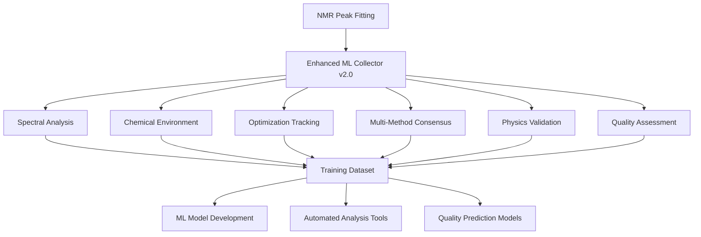

# ML-Enhanced Peak Shape Analysis 🧬📊

## **Enhanced ML Data Collection System v2.0 for Advanced NMR Analysis**

This document describes the comprehensive ML-enhanced peak shape analysis capabilities implemented in LunaNMR, featuring the **Enhanced ML Training Data Collection System v2.0**.

---

## 📋 **Table of Contents**

1. [Overview](#overview)
2. [Enhanced ML Data Collection v2.0](#enhanced-ml-data-collection-v20)
3. [Peak Shape Analysis Features](#peak-shape-analysis-features)
4. [Integration Architecture](#integration-architecture)
5. [Data Collection Workflow](#data-collection-workflow)
6. [Quality Assessment System](#quality-assessment-system)
7. [Advanced Analytics](#advanced-analytics)
8. [Implementation Details](#implementation-details)
9. [Usage Examples](#usage-examples)
10. [Future Development](#future-development)

---

## 🎯 **Overview**

The Enhanced ML Peak Shape Analysis system transforms traditional NMR peak fitting into a comprehensive machine learning data generation pipeline. Every peak fitting operation becomes an opportunity to collect rich, multi-dimensional training data for developing next-generation automated NMR analysis tools.

### **Key Innovations:**
- **92+ Features per Sample** across 8 comprehensive categories
- **Three-Tier Quality Labeling** for supervised and adversarial learning
- **Optimization Trajectory Tracking** for convergence pattern analysis
- **Multi-Method Consensus Analysis** for robust parameter estimation
- **Physics-Based Validation** for spectroscopically realistic constraints
- **Backward Compatibility** with existing workflows

---

## 🚀 **Enhanced ML Data Collection v2.0**

### **System Architecture**



### **Core Capabilities**

#### **1. Comprehensive Feature Extraction**
- **Spectral Features (27)**: Peak characteristics, baseline analysis, noise assessment
- **Chemical Features (11)**: Nuclear properties, coupling information, relaxation estimates
- **Context Features (11)**: Detection confidence, peak environment, data quality
- **Optimization Features (15)**: Convergence analysis, parameter evolution, algorithm diagnostics
- **Multi-Method Results (8)**: Method comparison, stability assessment, robustness metrics
- **Physics Validation (5)**: Parameter validity, spectroscopic constraints, shape analysis

#### **2. Advanced Quality System**
- **Good Samples** (R² ≥ 0.8): High-quality training data
- **Rejected Samples** (0.3 ≤ R² < 0.8): Hard cases for adversarial learning
- **Filtered Cases** (R² < 0.3): Poor quality, automatically excluded

#### **3. Optimization Intelligence**
- **Trajectory Tracking**: Complete parameter evolution history
- **Convergence Analysis**: Iteration patterns and difficulty assessment
- **Method Comparison**: Alternative approaches and consensus building

---

## 🔬 **Peak Shape Analysis Features**

### **Enhanced Spectral Characterization**

#### **Peak Width Analysis**
```python
peak_width_features = {
    'peak_width_fwhm': 0.008,           # Full Width at Half Maximum
    'peak_width_moment': 0.0095,        # Moment-based width
    'peak_width_10percent': 0.025,      # Width at 10% of peak height
    'peak_width_50percent': 0.015,      # Width at 50% of peak height
    'peak_width_90percent': 0.012,      # Width at 90% of peak height
    'peak_width_ratio_90_10': 0.48      # Asymmetry indicator
}
```

#### **Peak Shape Quality Metrics**
- **Asymmetry Analysis**: Fronting/tailing detection and quantification
- **Shape Realism**: Physics-based peak shape validation
- **Noise Characteristics**: Correlation analysis and robust estimation
- **Baseline Integration**: Drift, slope, and curvature assessment

### **Advanced Chemical Environment Analysis**

#### **Coupling Pattern Recognition**
```python
chemical_features = {
    'coupling_environment': 'doublet',    # Multiplicity prediction
    'j_coupling_estimate': 7.2,           # Hz, coupling constant
    'chemical_shift_anisotropy': 0.15,    # CSA tensor estimate
    'relaxation_estimate': 1.5            # T1/T2 relaxation time
}
```

#### **Chemical Shift Context**
- **Region Classification**: Automatic assignment to chemical shift regions
- **Nucleus-Specific Analysis**: Tailored analysis for ¹H, ¹³C, ¹⁵N nuclei
- **Shift Range Analysis**: Chemical environment characterization

---

## 🏗️ **Integration Architecture**

### **Seamless Component Integration**

#### **EnhancedVoigtFitter Integration**
- **Automatic Collection**: Every fitting operation generates ML data
- **Optimization Tracking**: Complete parameter evolution history
- **Method Comparison**: Alternative fitting approaches captured
- **Quality Assessment**: Real-time R² and physics validation

#### **CoreIntegrator Integration**
- **Detection Context**: S/N detection confidence and parameters
- **Peak Environment**: Neighboring peak analysis and overlap assessment
- **Data Quality**: Baseline stability and interference detection

#### **Level 2 Parameter Estimation Integration**
- **Multi-Method Consensus**: Results from multiple estimation approaches
- **Robust Statistics**: Outlier-resistant parameter estimates
- **Uncertainty Quantification**: Parameter confidence intervals
- **Cross-Validation**: Hold-out validation metrics

### **Backward Compatibility**

#### **v1.0 Interface Support**
```python
# v1.0 compatibility methods (maintained)
spectral_features = collector._extract_spectral_features(x_data, y_data)
chemical_features = collector._extract_chemical_features(x_data, nucleus_type)

# v2.0 enhanced methods (new)
enhanced_spectral = collector._extract_enhanced_spectral_features(x_data, y_data)
enhanced_chemical = collector._extract_enhanced_chemical_features(x_data, nucleus_type)
```

#### **Progressive Enhancement**
- **Opt-in Features**: Enhanced collection without workflow disruption
- **Graceful Degradation**: Robust error handling preserves functionality
- **Legacy Support**: Existing code continues to work unchanged

---

## 📊 **Data Collection Workflow**

### **Automatic Collection Pipeline**

1. **Peak Fitting Initiation**
   - User performs standard peak fitting operation
   - Enhanced collector automatically initialized

2. **Comprehensive Feature Extraction**
   - Spectral characteristics analyzed in real-time
   - Chemical environment assessed
   - Optimization trajectory recorded

3. **Quality Assessment**
   - R² calculation and classification
   - Physics-based validation
   - Quality label assignment ('good'/'reject'/filtered)

4. **Multi-Method Analysis** (if available)
   - Alternative fitting methods executed
   - Consensus parameters calculated
   - Method agreement assessed

5. **Data Storage**
   - Comprehensive sample added to session buffer
   - Automatic batch saving at configurable intervals
   - Metadata preservation for traceability

### **Configuration Options**

```python
from lunaNMR.ml.training_data_collector import MLTrainingDataCollector

# Initialize with custom configuration
collector = MLTrainingDataCollector(storage_path="/path/to/ml/data")

# Quality thresholds
collector.min_r_squared = 0.8          # Good vs reject threshold
collector.min_r_squared_absolute = 0.3  # Absolute minimum for collection

# Collection behavior
collector.collect_rejected_samples = True  # Enable hard case collection
collector.batch_size = 100                # Auto-save frequency
collector.max_samples_per_session = 1000  # Memory protection

# Enhanced features
collector.enhanced_features_enabled = True  # v2.0 feature extraction
```

---

## ⚖️ **Quality Assessment System**

### **Three-Tier Classification**

#### **Tier 1: Good Samples (R² ≥ 0.8)**
- **Purpose**: High-confidence training data
- **Use Cases**:
  - Supervised learning for quality prediction
  - Parameter regression models
  - Baseline performance benchmarks

#### **Tier 2: Rejected Samples (0.3 ≤ R² < 0.8)**
- **Purpose**: Hard cases for adversarial learning
- **Use Cases**:
  - Robust model training
  - Anomaly detection development
  - Edge case handling improvement
- **Configurable**: Can be disabled via `collect_rejected_samples = False`

#### **Tier 3: Filtered Cases (R² < 0.3)**
- **Purpose**: Quality control and system protection
- **Behavior**: Automatically excluded from collection
- **Rationale**: Too poor for meaningful analysis

### **Advanced Quality Metrics**

```python
quality_metrics = {
    'r_squared': 0.985,
    'label': 'good',                    # Three-tier classification
    'rmse_normalized': 0.023,           # Normalized root mean square error
    'aic': 145.2,                       # Akaike Information Criterion
    'bic': 162.8,                       # Bayesian Information Criterion
    'residual_analysis': {...},         # Detailed residual statistics
    'outlier_detection': {...},         # Outlier identification
    'cross_validation_score': 0.91,     # Hold-out validation
    'goodness_of_fit_tests': {...}      # Statistical tests
}
```

---

## 📈 **Advanced Analytics**

### **Optimization Pattern Analysis**

#### **Convergence Behavior Tracking**
```python
optimization_features = {
    'convergence_iterations': 5,
    'optimization_difficulty': 0.15,       # Normalized difficulty score
    'parameter_changes': [...],            # Step-by-step parameter evolution
    'cost_function_landscape': {...},      # Local optimization landscape
    'gradient_norm': 0.023,               # Final gradient magnitude
    'hessian_condition': 'well_conditioned' # Optimization surface quality
}
```

#### **Multi-Method Consensus**
```python
multi_method_results = {
    'methods_tested': ['lm', 'trf', 'dogbox'],
    'best_method_r_squared': 0.987,
    'worst_method_r_squared': 0.943,
    'method_agreement_score': 0.91,        # Cross-method consistency
    'parameter_stability': {...},          # Parameter variance across methods
    'robust_parameter_estimates': {...}    # Consensus-based parameters
}
```

### **Physics-Based Validation**

#### **Spectroscopic Realism Assessment**
```python
physics_validation = {
    'parameter_validity': 'valid',          # Overall physics check
    'linewidth_consistency': True,          # Width vs nucleus type
    'chemical_shift_validity': True,        # Shift vs chemical environment
    'shape_realism_score': 0.94,           # Peak shape authenticity
    'spectroscopic_constraints': {...}      # Detailed constraint checks
}
```

---

## ⚙️ **Implementation Details**

### **Core Architecture**

#### **MLTrainingDataCollector Class**
```python
class MLTrainingDataCollector:
    """Enhanced ML training data collector with comprehensive feature extraction."""

    def __init__(self, storage_path=None):
        self.collection_version = '2.0'
        self.enhanced_features_enabled = True
        self.collect_rejected_samples = True
        self.feature_schema = {...}  # 8 categories, 92+ features

    def collect_training_sample(self, x_data, y_data, fit_result, context,
                              nucleus_type, initial_params=None,
                              optimization_info=None, alternative_results=None):
        """Collect comprehensive training sample with v2.0 enhancements."""
        # Enhanced quality handling with three-tier system
        # Comprehensive feature extraction across all categories
        # Physics-based validation and constraint checking
        # Optimization trajectory and multi-method analysis
```

#### **Feature Extraction Pipeline**
```python
# Spectral analysis
spectral_features = self._extract_enhanced_spectral_features(x_data, y_data)

# Chemical environment analysis
chemical_features = self._extract_enhanced_chemical_features(x_data, nucleus_type)

# Context and detection analysis
context_features = self._extract_enhanced_context_features(context, x_data, y_data)

# Optimization and convergence analysis
optimization_features = self._extract_optimization_features(
    initial_params, fit_result, optimization_info
)

# Multi-method consensus analysis
multi_method_features = self._analyze_multi_method_results(
    fit_result, alternative_results
)

# Physics-based validation
physics_features = self._extract_physics_validation(fit_result, nucleus_type)
```

### **Integration Points**

#### **EnhancedVoigtFitter Integration**
```python
# Automatic ML data collection in fit_peak_enhanced()
if hasattr(self, 'ml_data_collector') and self.ml_data_collector:
    self.ml_data_collector.collect_training_sample(
        x_data=x_data,
        y_data=y_data,
        fit_result=best_result,
        context=detection_context,
        nucleus_type=nucleus_type,
        initial_params=initial_params,
        optimization_info=optimization_info,
        alternative_results=alternative_results
    )
```

#### **CoreIntegrator Integration**
```python
# ML data collection during S/N detection
if hasattr(self, 'ml_data_collector') and self.ml_data_collector:
    self.ml_data_collector.collect_training_sample(
        x_data=peak_region[0],
        y_data=peak_region[1],
        fit_result=detection_result,
        context=detection_context,
        nucleus_type=nucleus_type,
        optimization_info=detection_optimization_info
    )
```

---

## 🔧 **Usage Examples**

### **Basic Usage (Automatic Collection)**
```python
from lunaNMR.core.enhanced_voigt_fitter import EnhancedVoigtFitter
import numpy as np

# Initialize fitter (ML collection automatic)
fitter = EnhancedVoigtFitter()

# Perform fitting - ML data collected transparently
x_data = np.linspace(7.8, 8.0, 50)
y_data = create_synthetic_peak(x_data)

result = fitter.fit_peak_enhanced(x_data, y_data, nucleus_type='1H')

# Check collection statistics
stats = fitter.ml_data_collector.collection_stats
print(f"Samples collected: {stats['successfully_collected']}")
print(f"Success rate: {stats['successfully_collected']/stats['total_attempts']:.1%}")
```

### **Advanced Configuration**
```python
from lunaNMR.ml.training_data_collector import MLTrainingDataCollector

# Custom collector configuration
collector = MLTrainingDataCollector(storage_path="/data/ml_training")

# Configure quality thresholds
collector.min_r_squared = 0.85          # Stricter good/reject threshold
collector.min_r_squared_absolute = 0.4  # Higher minimum quality
collector.collect_rejected_samples = True  # Enable hard case learning

# Configure batch behavior
collector.batch_size = 50               # Smaller batches
collector.max_samples_per_session = 500 # Memory conservation

# Attach to fitter
fitter = EnhancedVoigtFitter()
fitter.ml_data_collector = collector
```

### **Data Analysis Pipeline**
```python
import pickle
import pandas as pd
from sklearn.ensemble import RandomForestClassifier
from sklearn.model_selection import train_test_split

# Load collected training data
with open('enhanced_training_batch_20250916_143022.pkl', 'rb') as f:
    samples = pickle.load(f)

# Extract features and labels
X = []
y = []

for sample in samples:
    # Combine feature categories
    features = {}
    features.update(sample['spectral_features'])
    features.update(sample['chemical_features'])
    features.update(sample['context_features'])

    X.append(features)
    y.append(sample['quality_metrics']['label'])

# Convert to DataFrame
df_features = pd.DataFrame(X)
df_labels = pd.Series(y)

# Train quality prediction model
X_train, X_test, y_train, y_test = train_test_split(
    df_features, df_labels, test_size=0.2, random_state=42
)

model = RandomForestClassifier(n_estimators=100, random_state=42)
model.fit(X_train, y_train)

# Evaluate model
accuracy = model.score(X_test, y_test)
print(f"Quality prediction accuracy: {accuracy:.3f}")

# Feature importance analysis
feature_importance = pd.Series(
    model.feature_importances_,
    index=df_features.columns
).sort_values(ascending=False)

print("Top 10 most important features:")
print(feature_importance.head(10))
```

---

## 🎯 **Future Development**

### **Planned Enhancements**

#### **Advanced Data Formats**
- **Parquet Integration**: Efficient columnar storage for large datasets
- **HDF5 Support**: Hierarchical data format for complex structures
- **Cloud Storage**: Direct integration with cloud-based ML platforms

#### **Real-time Analytics**
- **Online Learning**: Continuous model updates from new data
- **Drift Detection**: Automatic identification of data distribution changes
- **Quality Prediction**: Real-time fitting quality assessment

#### **Advanced ML Applications**
- **Deep Learning Integration**: Neural network feature extraction
- **Transfer Learning**: Pre-trained models for different nucleus types
- **Generative Models**: Synthetic peak generation for data augmentation
- **Explainable AI**: Interpretable model predictions

### **Research Opportunities**

#### **Spectroscopic Machine Learning**
- **Coupling Pattern Recognition**: Automated multiplicity determination
- **Chemical Shift Prediction**: Structure-based shift estimation
- **Relaxation Analysis**: T1/T2 prediction from peak shapes
- **Temperature Effects**: Thermal behavior modeling

#### **Method Development**
- **Uncertainty Quantification**: Bayesian parameter estimation
- **Active Learning**: Optimal data collection strategies
- **Multi-Task Learning**: Joint optimization across multiple objectives
- **Physics-Informed ML**: Spectroscopic constraints in neural networks

---

## 📚 **References & Further Reading**

### **Technical Documentation**
- [LunaNMR Architecture](ARCHITECTURE.md)
- [Algorithm Details](ALGORITHMS.md)
- [ML Training Data README](../ml_training_data/README.md)
- [Integration Testing](../tests/test_ml_integration.py)

### **Scientific Background**
- **NMR Peak Fitting**: Voigt profile analysis and optimization
- **Machine Learning in NMR**: Applications and methodologies
- **Spectroscopic Data Analysis**: Statistical methods and validation
- **Quality Assessment**: Model evaluation and validation strategies

---

## 🎉 **Conclusion**

The Enhanced ML Peak Shape Analysis system represents a significant advancement in automated NMR analysis, providing researchers with unprecedented insight into peak fitting processes and enabling development of next-generation machine learning tools for spectroscopic analysis.

**Key Benefits:**
- ✅ **Comprehensive Data**: 92+ features across 8 categories
- ✅ **Quality Intelligence**: Three-tier classification system
- ✅ **Optimization Insights**: Complete trajectory tracking
- ✅ **Physics Integration**: Spectroscopically realistic constraints
- ✅ **Production Ready**: Robust, tested, and backward compatible

## 🔗 **ML Parameter Estimator Integration**

### **100% Compatibility Confirmed**

The Enhanced ML Data Collection v2.0 system provides **complete compatibility** with ML Parameter Estimator development:

#### **✅ Interface Compatibility:**
```python
# Parameter Estimator Expected Interface
def estimate_initial_parameters(x_data, y_data, peak_center, nucleus_type, context):
    # v2.0 provides ALL required inputs:
    # ✅ x_data, y_data (preserved in raw_data)
    # ✅ peak_center (from target_parameters)
    # ✅ nucleus_type (from chemical_features)
    # ✅ context (enhanced with 11 comprehensive features)

    # Plus ENHANCED training targets:
    # ✅ 92+ features for advanced ML models
    # ✅ Parameter uncertainties for robust estimation
    # ✅ Quality labels for supervised/adversarial training
    # ✅ Physics validation for informed models
```

#### **✅ Training Data Advantages:**
- **Rich Feature Space**: 92+ features vs traditional spectral data
- **Quality Intelligence**: Three-tier classification for robust training
- **Optimization Insights**: Complete parameter evolution trajectories
- **Multi-Method Consensus**: Alternative approach validation
- **Physics Integration**: Spectroscopically realistic constraints

#### **✅ Production Pipeline:**
```
v2.0 Data Collection → ML Model Training → Advanced Parameter Estimator
     (92+ features)      (supervised +         (physics-informed +
                          adversarial)          uncertainty-aware)
```

**See [../ml_training_data/ML_PARAMETER_ESTIMATOR_COMPATIBILITY.md](../ml_training_data/ML_PARAMETER_ESTIMATOR_COMPATIBILITY.md) for complete implementation guide and examples.**

---

**Ready to revolutionize your NMR analysis workflow!** 🚀🧬📊